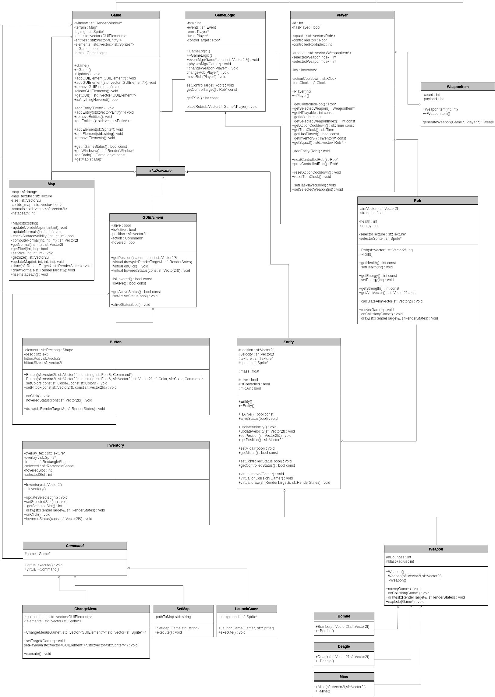

# RobS
### Un projet d'OOP par Benjamin Sitbon & Wilson Crochet

## Présentation du repo
### Branches

* **main**  
C'est la branche fonctionnelle de notre projet. Elle ne comporte pas toutes nos prouesses, mais elle a le mérite de fonctionner sans bugs.
* **Refactoring**  
C'est la branche qui est, en théorie, beaucoup mieux codée et optimisée (c'est à dire que les attributs ne sont pas en public, par exemple). Cependant, au 6 juin 2022 à 23h00, elle comporte encore des soucis comme des segfaults, ou une physique bancale.
* **Rendu**
C'est la branche qui concerne nos chers et chères professeur.e.s car c'est sur celle-ci que nous sommes évalués

## Présentation du jeu
Le jeu est un worms-like, le but est de tuer toute l’équipe adverse. Pour ce faire il y a plusieurs options :
* les armes
* "l’eau"
* les pièges

**L’équipe qui perd tous ses joueurs en première a perdu.**

## Compilation
`make` : génère l'exécutable `main`  
`make main` : génère l'exécutable `main` en gardant les   fichiers .o  
`make clean` : supprime les fichiers .o  
`make purge` : supprime les fichiers .o et `main`  

## Contrôles
```
Espace : saut
Q : sautiller à gauche
D : sautiller à droite

M : Sélectionner Mine
L : Sélectionner Deagle
K : Sélectionner Bombe

Clic gauche : tirer
Flèche gauche : contrôle du rob précédent
Flèche droite : contrôle du rob suivant
```

### Les armes
En effet, il y a deux armes possibles, et on pourrait en ajouter plus grâce à notre classe abstraite `Weapon`

#### La bombe (touche K)
La bombe est un projectile lourd, elle ne peut pas voler très loin et est très vite attiré par le sol, en revanche elle fait beaucoup de dégâts et possède un rayon d’explosion élevé.

#### Le pistolet (touche L)
Le pistolet est un projectile léger, il vole quasiment droit sur de longues distances, mais possède des dégâts peu élevés.

### Les pièges

#### La mine (touche M)
Le joueur a aussi la possibilité de placer des mines sur la carte. Si un personnage (lui y compris) passe sur une mine alors elle explose immédiatement et cause de nombreux dégâts aux joueurs à proximité.  
NB : la version Rendu ne permet pas cette fonctionnalité : la mine est globalelement un kit de suicide

### "L'eau"
Lorsque tous les joueurs ont effectué leur tour de jeu, alors "l’eau" monte et commence à recouvrir notre carte. Si un joueur tombe dans "l’eau", il meurt.  
NB : l'eau est modélisée par le terrain qui se détruit progressivement.

## Bibliothèques utilisées
`SFML`, `vector`, `cmath`, `iostream`

## Reste à faire

* implémentation d'armes avec rebonds
* implémentation de knockback
* implémentation de munitions et d'armes qui tombent du ciel
* correction du bug qui ne met pas graphiquement à jour l'arme sélectionnée lors d'un changement de joueur
* affichage de l'énergie (pour l'instant inutile) et la vie sur l'inventaire
* graphiques décents
* plus de maps
* tests unitaires

## UML

